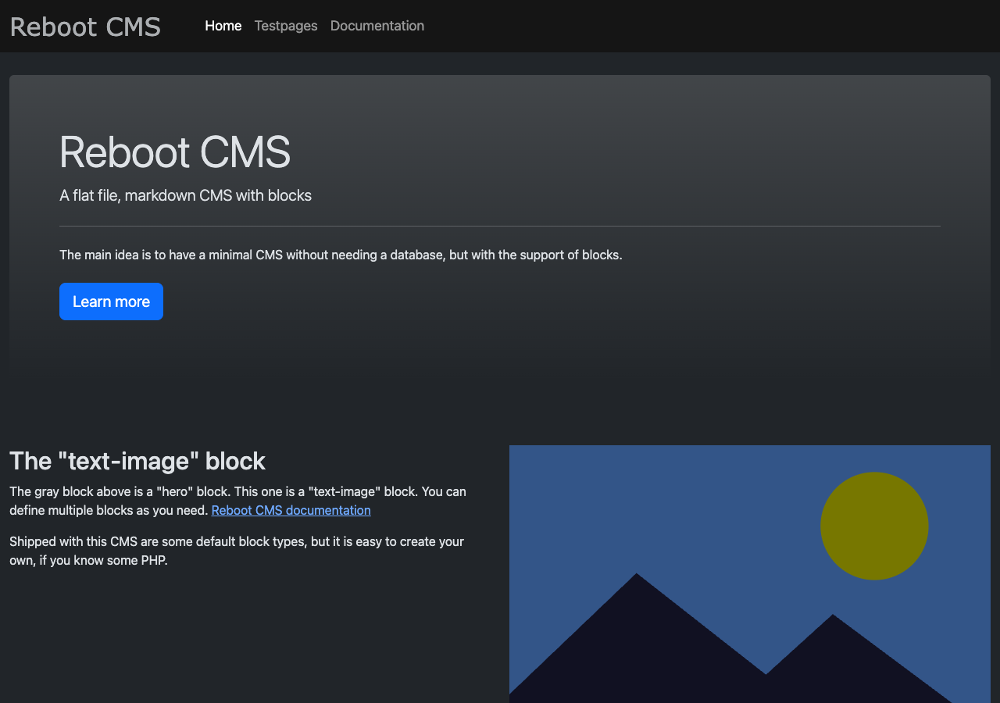
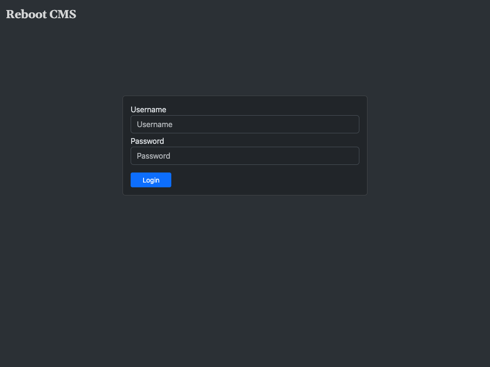
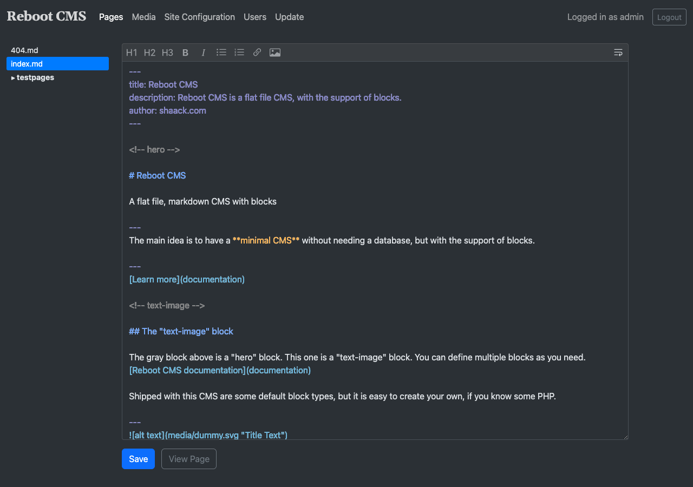
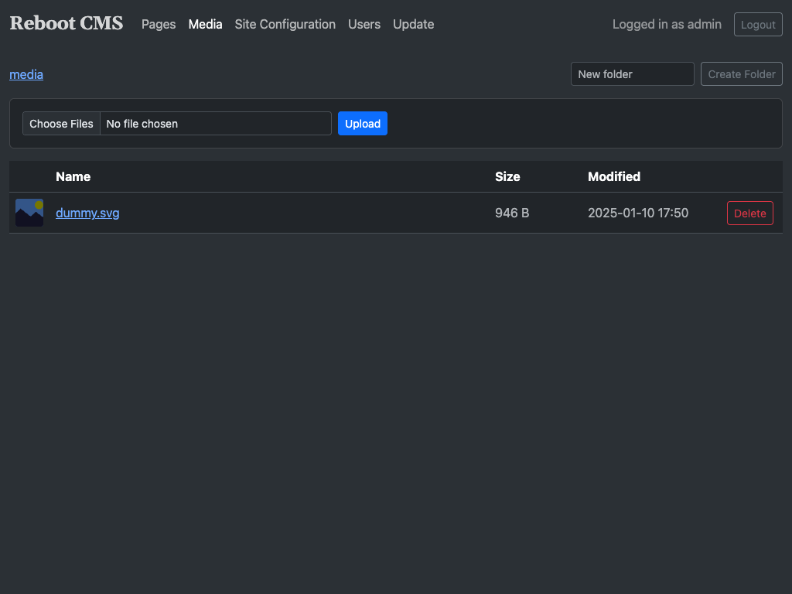
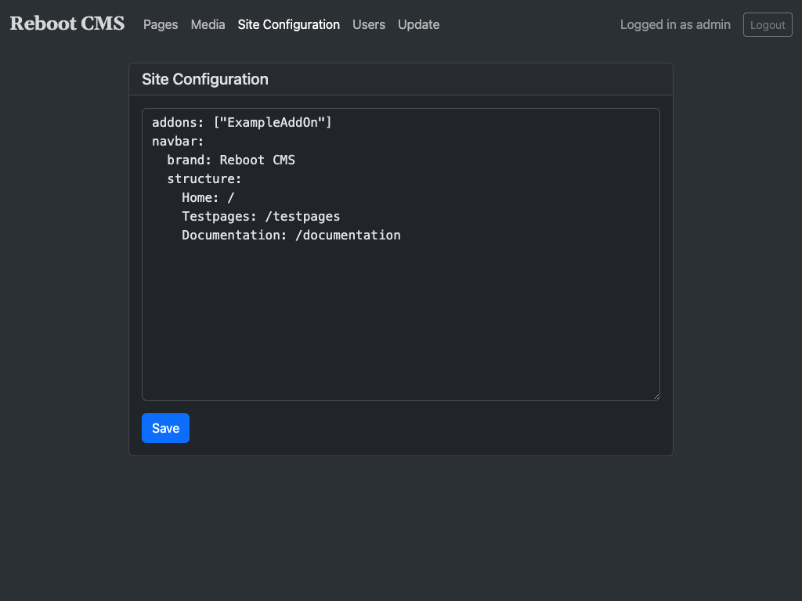
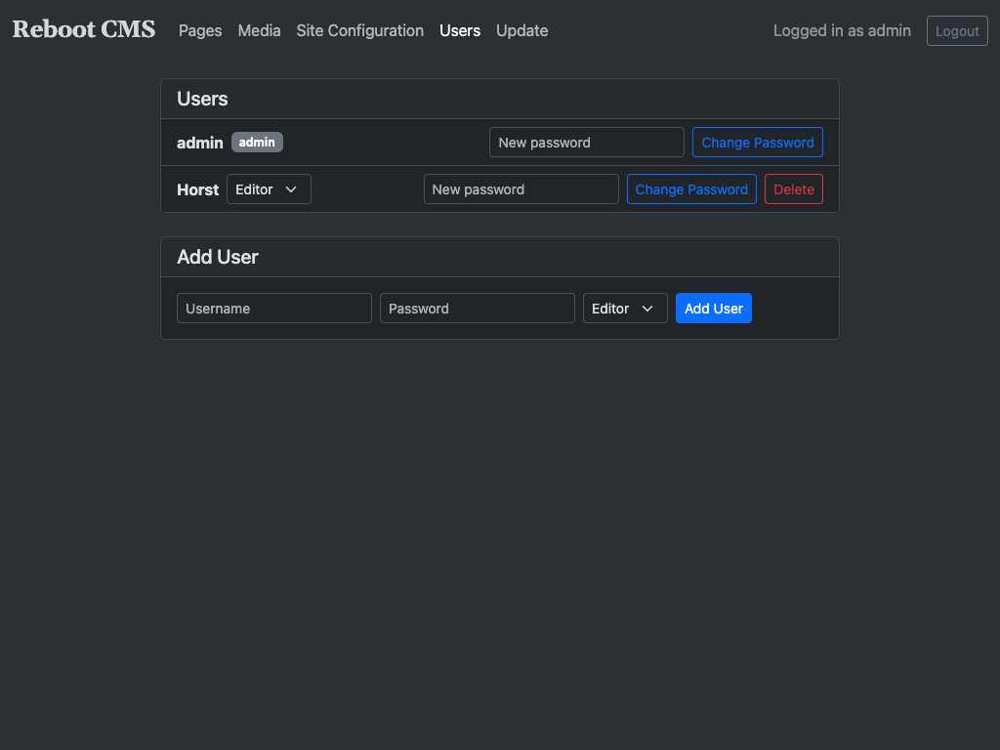
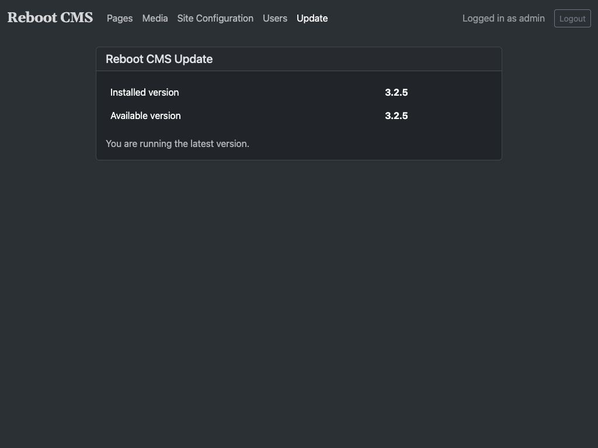

# Reboot CMS

A flat file, Markdown CMS in PHP, inspired by [Pico](http://picocms.org), [Redaxo](https://redaxo.org/)
and [Craft CMS](https://craftcms.com/).

Reboot CMS is a minimal CMS without a database, but with the support of **blocks** 🚀.

## Why another CMS?

I developed Reboot CMS because I couldn't find a CMS that works with flat markdown files but allows easy use of blocks.

Reboot CMS is very small and the pages are delivered extremely fast. My website [shaack.com](https://shaack.com), built
with Reboot CMS, has
a [PageSpeed Insights performance score of 100](https://pagespeed.web.dev/report?url=https%3A%2F%2Fshaack.com%2F).

## Websites using Reboot CMS

- [The Reboot CMS demo page](https://shaack.com/projekte/reboot-cms/)
- [shaack.com](https://shaack.com)
- [wukies.de](https://wukies.de)
- [chesscoin032.com](https://chesscoin032.com)

## Minimum System Requirements

- **PHP** 8.0 or higher
- **PHP Extensions:** json, fileinfo, dom
- **Web Server:** Apache with mod_rewrite (or compatible server)
- **Composer** for PHP dependency management
- **No database required** — all content is stored as flat files

## Install

Clone or download the [Reboot CMS repository](https://github.com/shaack/reboot-cms):

```bash
git clone https://github.com/shaack/reboot-cms.git my-site
```

All dependencies are included in the repository, so no `composer install` is needed.

### Setup

Point your web server's document root to the `web/` directory. The CMS should work out of the box.

On first visit to `/admin`, you will be prompted to create an admin account.

## Directory Structure

- `core/src/` — Core CMS classes (Reboot, Site, Page, Block, Request, AddOn)
- `site/` — Site content: `pages/`, `blocks/`, `addons/`, `template.php`, `config.yml`
- `web/` — Document root (`index.php`, `.htaccess`)
- `local/` — Local environment config (`config.yml`, `.htpasswd`) — not in git
- `core/admin/` — Admin interface (itself a Reboot CMS site)

## Configuration

- `site/config.yml` — Site-wide settings: addon registration, navbar with `brand` and `structure`
- `local/config.yml` — Local settings: `logLevel` (0=debug, 1=info, 2=error)

## Template

The file `site/template.php` is the main HTML template. It receives three variables:

- `$site` — the `Site` object
- `$page` — the `Page` object
- `$request` — the `Request` object

Call `$page->render($request)` to render the page content and `$page->getConfig()` to access the YAML front matter.

## Documentation

### Page

Folder: `/site/pages`

A `Page` can be a **flat Markdown** file, can contain **Blocks** or also can be a **PHP** file.

Pages are auto-routed on web-requests:

- `index.md` or `index.php` will be shown on requesting `/`
- `NAME.md` or `NAME.php` will be shown on requesting `/NAME`
- `FOLDER/index.md` (or .php) will be shown on requesting `/FOLDER`
- `FOLDER/NAME.md` (or .php) will be shown on requesting `/FOLDER/NAME`
- `404.md` (or .php) will be used as a custom 404 error page

Example for a Markdown `Page` with `Blocks`:

```markdown
---
title: Reboot CMS 
description: Reboot CMS is a flat file CMS, with the support of blocks. 
author: Stefan Haack (shaack.com)

---

<!-- hero -->

# Reboot CMS

A flat file, markdown CMS with blocks

---
The main idea is, to have a **minimal CMS** without needing a database, but with the support of blocks.

---
[Learn more](documentation)

<!-- text-image -->

## The text-image block

The gray block above was a hero block. This one is a text-image block, it contains two parts. Parts are separated by
`---`.

---


<!-- 
text-image:
    image-position: left
-->

## Configure blocks in the block comment

The text-image block can also display the image to the left.

---
>

<!-- three-columns -->

### the

Duis aute irure dolor in reprehenderit in voluptate velit esse cillum dolore eu fugiat nulla pariatur. Excepteur sint
occaecat cupidatat non proident, sunt in culpa qui officia deserunt mollit anim id est.

---

### three-colums

Ut enim ad minim veniam, quis nostrud exercitation ullamco laboris nisi ut aliquid ex ea commodi consequat. Quis aute
iure reprehenderit in voluptate velit esse cillum dolore eu fugiat nulla pariatur.

---

### block

Lorem ipsum dolor sit amet, consectetur adipisicing elit, sed do eiusmod tempor incididunt ut labore et dolore magna
aliqua.

```

This `Page` contains 3 `Block` types, "hero", "text-image" and "three-columns". It will render to this:



Blocks can be configured in the block comment. With this configuration, the `text-image`
block allows to display the image to the left side in desktop view.

Markdown files without blocks will render to a flat Markdown page like in every other flat file CMS.

You can define metadata for the page on top of the file in `YAML Front Matter` syntax.

### Block

Folder: `/site/blocks`

A `Block` describes how a block is rendered. Blocks are written in PHP.

The code for the "text-image" `Block` which was used in the page above, looks like this:

```php
<?php
// read the configuration
$imagePosition = @$block->getConfig()["image-position"];
?>
<section class="block block-text-image">
    <div class="container-fluid">
        <div class="row">
            <div class="col-md-6 <?= $imagePosition === "left" ? "order-md-1" : "" ?>">
                <!-- all text from part 1 (xpath statement) -->
                <?= $block->nodeHtml($block->xpath("/*[part(1)]")) ?>
            </div>
            <div class="col-md-6">
                <!-- using attributes of the image in part 2 -->
                nodeHtml($block->xpath("//img[part(2)]/@src")) ?>"
                     alt="<?= $block->nodeHtml($block->xpath("//img[part(2)]/@alt")) ?>"
                     title="<?= $block->nodeHtml($block->xpath("//img[part(2)]/@title")) ?>"/>
            </div>
        </div>
    </div>
</section>
```

Elements in the markdown are queried and used as values for the block. The query syntax
is [Xpath](https://devhints.io/xpath) with the addition of the `part(n)` function.

Use `$block->content()` to get the full block content as rendered HTML (without XPath querying).
This is useful for simple blocks like "text":

```php
<section class="block block-text">
    <div class="container-fluid">
        <?= $block->content() ?>
    </div>
</section>
```

Another example, the "hero" `Block`:

```php
<?php /* hero */ ?>
<section class="block block-hero">
    <div class="container-fluid">
        <div class="card border-0 bg-gradient">
            <div class="card-body">
                <div class="p-xl-5 p-md-4 p-3">
                    <!-- use the text of the <h1> in part 1 for the display-4 -->
                    <h1 class="display-4"><?= $block->nodeHtml($block->xpath("/h1[part(1)]/text()")) ?></h1>
                    <!-- the lead will be the text of the <p> in part 1 -->
                    <p class="lead"><?= $block->nodeHtml($block->xpath("/p[part(1)]/text()")) ?></p>
                    <hr class="my-4">
                    <!-- print everything from part 2 -->
                    <div class="mb-4">
                        <?= $block->nodeHtml($block->xpath("/*[part(2)]")) ?>
                    </div>
                    <p>
                        <!-- the link in part 3 will be used as the primary button -->
                        <a class="btn btn-primary btn-lg"
                           href="<?= $block->nodeHtml($block->xpath("//a[part(3)]/@href")) ?>"
                           role="button"><?= $block->nodeHtml($block->xpath("//a[part(3)]/text()")) ?></a>
                    </p>
                </div>
            </div>
        </div>
    </div>
</section>
```

## Admin interface

You find the admin interface at `/admin`.

If no users exist yet (e.g. on a fresh installation), the admin interface will automatically show a setup page where
you can create the first admin account. After that, you can log in with the credentials you created.

In the admin interface you can edit markdown pages, manage media files, set the site configuration, manage users,
and update the CMS.

### Login



### Edit a page

The "Pages" section lists all markdown pages in your site. Click on a page name to open it in the editor.
Pages are organized in a tree structure reflecting the folder hierarchy in `site/pages/`.



### Media

The "Media" section lets you manage files in the `web/media/` directory. You can upload files, create folders,
and delete files or empty folders. Media files are accessible at `/media/` in the browser and can be referenced
in your markdown pages.



### Site configuration

In the site configuration, you can store global values of the site, like the navigation structure or the content of
header elements. The site configuration is written in YAML.



### User management

The "Users" page in the admin interface allows you to manage admin accounts directly from the browser. You can:

- **Add users** — create new admin accounts with a username and password
- **Change passwords** — update the password for any existing user
- **Delete users** — remove admin accounts (you cannot delete your own account)

Usernames may contain letters, numbers, and underscores (max 64 characters). Passwords must be at least 8 characters.
All credentials are stored as APR1-MD5 hashes in `local/.htpasswd`.



You can also manage users via the command line:

```sh
cd local
htpasswd .htpasswd admin
```

### Update

The "Update" page in the admin interface shows the currently installed version and checks for available updates from
the [GitHub repository](https://github.com/shaack/reboot-cms).

When an update is available, you can apply it directly from the admin interface. The updater downloads the latest
release and replaces `core/`, `web/admin/`, and `vendor/`. Your site content (`site/`), local configuration (`local/`),
and entry point (`web/index.php`) are not affected.

It is recommended to make a backup of the project folder before updating.



## AddOns

In Reboot CMS you can extend the functionality of your site with **AddOns**. AddOns allow you to hook into the request
lifecycle to add authentication, modify rendered content, inject headers, track analytics, or implement any custom logic.

### Creating an AddOn

An AddOn is a PHP class that extends [`AddOn`](core/src/Shaack/Reboot/AddOn.php). Place your AddOn file in
`site/addons/` with the class name matching the file name.

```php
<?php
// site/addons/MyAddOn.php

namespace Shaack\Reboot;

use Shaack\Logger;

class MyAddOn extends AddOn
{
    protected function init()
    {
        // Called once when the AddOn is loaded
        Logger::info("MyAddOn initialized");
    }

    public function preRender(Request $request): bool
    {
        // Called before page rendering
        // Return true to continue, false to stop (e.g. after a redirect)
        return true;
    }

    public function postRender(Request $request, string $content): string
    {
        // Called after page rendering, can modify the HTML output
        return $content;
    }
}
```

### Registering AddOns

Register your AddOns in `site/config.yml`. They are loaded and executed in the order listed:

```yml
addons: [ MyAddOn, AnotherAddOn ]
```

### Available Properties

Inside your AddOn, you have access to:

- `$this->reboot` — the [`Reboot`](core/src/Shaack/Reboot/Reboot.php) instance (base paths, config, redirects)
- `$this->site` — the [`Site`](core/src/Shaack/Reboot/Site.php) instance (site config, paths, other addons)

### Lifecycle Hooks

#### `init(): void`

Called once after construction of the AddOn. Use this to initialize data, read configurations, or start sessions.

#### `preRender(Request $request): bool`

Called on every request before rendering the page. Use it to:

- **Control access** — check authentication and redirect unauthorized users
- **Modify request handling** — perform redirects based on request path or parameters

Return `true` to continue rendering the page, or `false` to stop (e.g. after calling `$this->reboot->redirect()`).

#### `postRender(Request $request, string $content): string`

Called after the page is rendered, before the output is sent to the browser. Use it to:

- **Modify HTML output** — inject scripts, stylesheets, or meta tags
- **Add tracking** — append analytics snippets
- **Transform content** — search and replace patterns in the rendered HTML

Returns the (possibly modified) content string.

### Accessing AddOns from Pages

You can access a registered AddOn from any page template using:

```php
$myAddOn = $site->getAddOn("MyAddOn");
```

### Examples

See the included [ExampleAddOn.php](site/addons/ExampleAddOn.php) for a basic implementation. The admin interface
itself uses AddOns: [Authentication](core/admin/addons/Authentication.php) for login session handling and
[Admin](core/admin/addons/Admin.php) for admin-specific functionality.