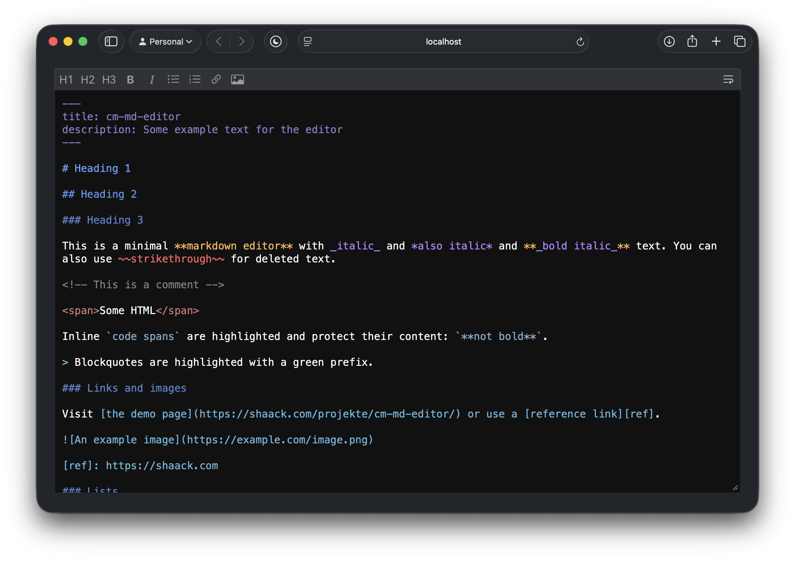

# cm-md-editor

A minimal, dependency-free markdown editor as a vanilla JavaScript ES6 module.

[Demo](https://shaack.com/projekte/cm-md-editor/)



## Key features

- Vanilla JavaScript module, zero dependencies
- Syntax highlighting for headings, bold, italic, code, lists, links, images, blockquotes, HTML tags, horizontal rules, front matter and more
- Toolbar with configurable buttons (headings, bold, italic, lists, links, images)
- Word wrap toggle with persistent state (localStorage)
- List mode: Tab/Shift-Tab to indent/outdent, auto-continuation on Enter
- Bold with Ctrl/Cmd+B, italic with Ctrl/Cmd+I
- Native undo/redo support (Ctrl/Cmd+Z / Ctrl/Cmd+Shift+Z)
- Lightweight, fast, easy to use

## Installation

```bash
npm install cm-md-editor
```

## Usage

```html
<textarea id="editor"></textarea>

<script type="module">
    import {MdEditor} from "cm-md-editor/src/MdEditor.js"

    const editor = new MdEditor(document.getElementById("editor"))
</script>
```

With custom configuration:

```javascript
const editor = new MdEditor(document.getElementById("editor"), {
    wordWrap: false,
    toolbarButtons: ["h1", "h2", "bold", "italic", "ul", "link"]
})
```

## Configuration (props)

All props are optional. Pass them as the second argument to the constructor.

| Prop | Type | Default | Description |
|------|------|---------|-------------|
| `wordWrap` | `boolean` | `true` | Default word wrap state. Overridden by localStorage if the user has toggled it |
| `toolbarButtons` | `string[]` | `["h1", "h2", "h3", "bold", "italic", "ul", "ol", "link", "image"]` | Which toolbar buttons to show. Available: `h1`, `h2`, `h3`, `bold`, `italic`, `ul`, `ol`, `link`, `image` |
| `colorHeading` | `string` | `"100,160,255"` | RGB color for headings |
| `colorCode` | `string` | `"130,170,200"` | RGB color for code spans and fenced code blocks |
| `colorComment` | `string` | `"128,128,128"` | RGB color for HTML comments |
| `colorLink` | `string` | `"100,180,220"` | RGB color for links and images |
| `colorBlockquote` | `string` | `"100,200,150"` | RGB color for blockquote prefixes |
| `colorList` | `string` | `"100,200,150"` | RGB color for list markers |
| `colorStrikethrough` | `string` | `"255,100,100"` | RGB color for ~~strikethrough~~ |
| `colorBold` | `string` | `"255,180,80"` | RGB color for **bold** |
| `colorItalic` | `string` | `"180,130,255"` | RGB color for _italic_ |
| `colorHtmlTag` | `string` | `"200,120,120"` | RGB color for HTML tags |
| `colorHorizontalRule` | `string` | `"128,128,200"` | RGB color for horizontal rules |
| `colorEscape` | `string` | `"128,128,128"` | RGB color for escape sequences |
| `colorFrontMatter` | `string` | `"128,128,200"` | RGB color for YAML front matter |

Colors are specified as RGB strings (e.g. `"255,180,80"`) and rendered at full opacity.

## Keyboard shortcuts

| Shortcut | Action |
|----------|--------|
| Ctrl/Cmd + B | Toggle bold |
| Ctrl/Cmd + I | Toggle italic |
| Tab | Indent list item or insert tab |
| Shift + Tab | Outdent list item |
| Enter | Auto-continue list (unordered and ordered) |

## License

MIT
